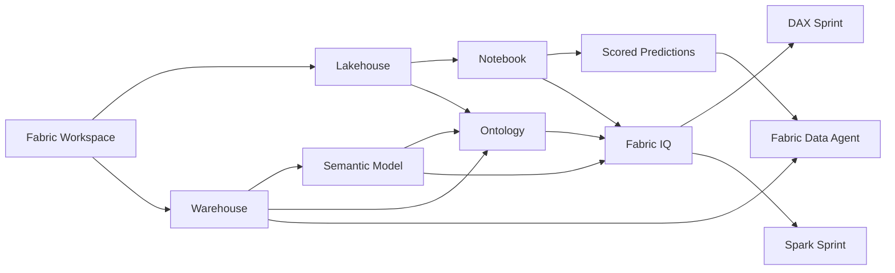

# Getting Started

Welcome to Module 8: **Fabric IQ**. In this standalone module, you will build an end-to-end Microsoft Fabric solution from scratch in a new workspace and use it to explore a connected **retail demand and inventory insights** scenario. Instead of relying on prebuilt lab assets, you will create the workspace, lakehouse, warehouse, semantic model, notebook, ontology, and Fabric data agent yourself, then use Fabric IQ to guide both DAX and Spark generation over the data you prepare during the lab.

## Lab scenario

A retail analytics team wants a compact but realistic environment for understanding how Fabric IQ can ground business questions across multiple Fabric items. Your goal is to create that environment in a fresh workspace, prepare the analytical and notebook-based data paths, publish an ontology, use IQ-assisted DAX to answer inventory and sales questions, and expose model output through a Fabric data agent for natural-language exploration.

## What you will build

By the end of this module, you will have created:

- A new Microsoft Fabric workspace for this lab
- A lakehouse for source data and prediction outputs
- A warehouse with retail-oriented analytical tables
- A semantic model that supports Fabric IQ-assisted DAX work
- A notebook used for model preparation, scoring, and Spark refinement
- An ontology published in the workspace for business grounding
- A Fabric data agent that answers questions over scored and analytical data

## Objectives

After completing this module, you will be able to:

- Create and organize core Microsoft Fabric items in a new workspace
- Prepare data for both warehouse analytics and notebook-based model work
- Verify that Fabric IQ is available and generate an ontology from your prepared assets
- Use Fabric IQ to generate and refine DAX for business questions
- Score model output, persist predictions, and summarize them with Spark
- Build a Fabric data agent over curated Fabric data

## Prerequisites

Before you begin, make sure you have:

- Access to Microsoft Fabric with permission to create workspaces and Fabric items
- A Fabric capacity or Fabric Trial environment where the required Fabric features are available
- Permission to use or verify preview features required for ontology and Fabric IQ experiences in your tenant
- Familiarity with basic Fabric navigation, notebooks, SQL, and semantic models
- Any sample source files or starter content provided by your instructor, if your environment requires them

> [!Important]
> This is a **standalone** module. The lab does not provision Fabric items for you. You will create the required workspace items during the exercises.

## Sign in

1. Open the Microsoft Fabric portal at <https://app.fabric.microsoft.com>.
2. Sign in using the following lab credentials:
   - Username: `<inject key="AzureAdUserEmail"></inject>`
   - Password: `<inject key="AzureAdUserPassword"></inject>`
3. If prompted to choose an account or tenant, continue with the account assigned to this lab.
4. Keep your deployment identifier available for naming guidance during the lab: **<inject key="DeploymentID" enableCopy="false"></inject>**.

> [!Tip]
> If you already have multiple Fabric workspaces, use your deployment identifier to help keep this lab's workspace and items distinct from any existing assets.

## Architecture

The module follows a single workspace pattern in which OneLake-backed data, warehouse analytics, semantic modeling, notebook processing, ontology grounding, and conversational exploration all stay connected inside Microsoft Fabric.

## Components explained

- **Workspace:** The shared container for all items you create in this module.
- **Lakehouse:** Stores source data, working tables, and scored output in OneLake.
- **Warehouse:** Hosts the retail-oriented tables used for analytical exploration.
- **Semantic model:** Provides curated relationships and measures for DAX generation and analysis.
- **Notebook:** Used to prepare data, score model output, and refine Spark-generated transformations.
- **Ontology:** Adds shared business meaning across your Fabric assets so Fabric IQ and downstream experiences work from a common vocabulary.
- **Fabric data agent:** Lets you ask natural-language questions against scoped Fabric data sources.

## Exercise map

### Exercise 1: Activate Fabric IQ and prepare the retail insights workspace

In Exercise 1, you create the new workspace and all core assets for the module. You will set up the lakehouse, warehouse, notebook, and semantic model foundations, then verify or enable Fabric IQ and generate an ontology for the workspace.

### Exercise 2: Run an IQ-guided DAX sprint with guided warehouse exploration

In Exercise 2, you use the semantic model and ontology to generate DAX from business intent, refine the generated logic, and review the warehouse context that supports the analytical workflow.

### Exercise 3: Build a Fabric Data Agent and run an IQ-guided Spark sprint on model output

In Exercise 3, you work in the notebook and prediction output path, build a Fabric data agent over curated data, and use Fabric IQ to generate and refine Spark code for summarizing model results.

## Lab notes

- Fabric IQ, ontology, and some related experiences can be preview features depending on your tenant and region.
- The exact menu labels can vary slightly as Microsoft Fabric evolves, but this guide uses current Microsoft Learn terminology such as **workspace**, **lakehouse**, **warehouse**, **semantic model**, **ontology (preview)**, and **Fabric data agent**.
- Complete the exercises in order because each exercise builds on assets created in the previous one.

## After publishing

> [!Note] These steps run **after** you push the template to CloudLabs — they verify CloudLabs can actually serve this lab guide to candidates.

- **Verify docs-proxy access:** open Templates → your template → **Lab Guide Settings** in <https://admin.cloudlabs.ai> and confirm CloudLabs can reach this repo via the docs proxy. If the repo is private, configure GitHub access at the template level.
- **Verify inline questions and inline validations:** sign in to <https://admin.cloudlabs.ai>, open your template, and walk through one full lab run to confirm every `<question>` and `<validation step="..."/>` renders correctly. Fix any that don't resolve.
