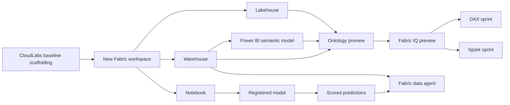

# Getting Started

Welcome to Module 8: **Fabric IQ**. In this standalone lab, you will build an end-to-end Microsoft Fabric solution in a brand-new workspace and use it to support a connected **retail demand and inventory insights** story. Rather than working in a prebuilt environment, you will create the core Fabric items yourself and then use them together across storage, warehousing, semantic modeling, notebook-based prediction, ontology grounding, and natural-language analysis.

By the end of the module, you will have a workspace that includes a **lakehouse**, **warehouse**, **Power BI semantic model**, **notebook**, **ontology (preview)**, and **Fabric data agent**, all tied to one business workflow. You will also use **Fabric IQ (preview)** to guide both a DAX sprint and a Spark sprint so you can see how shared business context carries across multiple Fabric experiences.

## Lab scenario

You are part of a retail analytics team that wants to study demand, inventory position, and prediction output in one governed Microsoft Fabric environment. The team needs a compact but realistic workspace that connects analytical tables, notebook-driven model work, semantic modeling, and business-friendly questioning. In this module, you will create that environment from scratch in a new workspace, prepare the data assets that support it, publish an ontology for shared business meaning, generate and refine DAX with Fabric IQ, score model output in a notebook, and expose those results through a Fabric data agent.

## Lab overview

This module is a **self-contained standalone experience**. The Azure deployment behind the lab provides only the minimum CloudLabs scaffolding needed for access and governance. It does **not** pre-create the Fabric learning items used in the exercises.

During the lab, you will create and use these items yourself:

- A new Microsoft Fabric workspace
- A lakehouse for working tables and prediction output
- A warehouse for retail fact and dimension tables
- A Power BI semantic model based on the warehouse tables
- A notebook for data generation, training, registration, scoring, and Spark work
- An ontology (preview) for shared business context
- A Fabric data agent for natural-language questions over curated data

## Objectives

After completing this module, you will be able to:

- Create and organize the Fabric items required for a standalone Fabric IQ workflow
- Prepare warehouse-based and notebook-based data paths for one connected scenario
- Verify that Fabric IQ is available and publish an ontology (preview)
- Use Fabric IQ to generate and refine DAX against a semantic model
- Train and score a simple model in a notebook and persist prediction output in Fabric
- Build a Fabric data agent over prediction and analytical data
- Use Fabric IQ to generate and refine Spark transformations over scored output
- Relate prediction outputs back to warehouse context in the final exercise

## Prerequisites

Before you begin, make sure the following are true:

- You can sign in to Microsoft Fabric with the lab-provided account.
- You have permission to create a workspace and Fabric items.
- The lab environment provides a Fabric capacity or trial where the required features are available.
- The tenant or capacity configuration allows **Fabric IQ (preview)**, **ontology (preview)**, Copilot-assisted generation, and **Fabric data agent** experiences used in this module.
- You are comfortable with basic Fabric navigation, SQL, notebooks, and semantic models.

> [!Important]
> This module starts from an empty or nearly empty state. No workspace, lakehouse, warehouse, semantic model, notebook, ontology, or data agent is pre-created for you.

> [!Note]
> Some features in this lab use current **preview** experiences in Microsoft Fabric. The guide follows current Microsoft Learn terminology for **Fabric IQ (preview)**, **ontology (preview)**, **Power BI semantic model**, **warehouse**, **lakehouse**, and **Fabric data agent**.

## Sign in

1. Open the Microsoft Fabric portal at <https://app.fabric.microsoft.com>, and sign in with **<inject key="AzureAdUserEmail"></inject>** and **<inject key="AzureAdUserPassword"></inject>**. If you are prompted to choose an account or tenant, continue with the lab-provided identity and stay in Microsoft Fabric.
2. Keep your deployment identifier available because you will use it to keep names unique during the lab: **<inject key="DeploymentID" enableCopy="false"/>**.

> [!Tip]
> If you already have access to multiple workspaces or Fabric items, append your deployment identifier to the names you create so your lab assets are easy to recognize later.

## Architecture

This lab uses one Microsoft Fabric workspace as the center of the workflow. Inside that workspace, you will create storage, analytics, modeling, machine learning, ontology, and natural-language exploration components that all support the same retail scenario.

## Architecture walkthrough

The diagram shows how the module fits together:

- **CloudLabs baseline scaffolding** provides only the minimum lab-access foundation.
- Your **new Fabric workspace** contains all the items you create during the module.
- The **lakehouse** stores working data and prediction output in OneLake-backed storage.
- The **warehouse** holds structured retail analytics tables.
- The **Power BI semantic model** provides relationships, business-friendly fields, and DAX-ready analytical context.
- The **notebook** is where you generate data, train and register a model, score predictions, and later run Spark transformations.
- The **ontology (preview)** provides shared business meaning across the relevant Fabric assets.
- **Fabric IQ (preview)** uses that context to support business-aware code generation and reasoning.
- The **Fabric data agent** lets you ask natural-language questions over the curated data scope you prepare.

## Components you will use

### Workspace
Your workspace is the central container for the module.

### Lakehouse
The lakehouse stores working data and prediction-related output.

### Warehouse
The warehouse provides structured SQL analytics over the retail scenario.

### Power BI semantic model
The semantic model defines tables, relationships, and measures for analysis and DAX generation.

### Notebook
The notebook handles data generation, training, registration, scoring, and Spark-based refinement.

### Ontology (preview)
The ontology gives Fabric IQ a shared business vocabulary by connecting business entities and relationships to your prepared data.

### Fabric IQ (preview)
Fabric IQ is the business-context layer used in this module to support ontology-grounded reasoning and guided generation experiences.

### Fabric data agent
The Fabric data agent lets you ask natural-language questions over the curated prediction and analytical data you prepare in the lab.

## Exercise map

Complete the exercises in order because later work depends on the assets you create earlier.

- **Exercise 1: Create the workspace, data assets, notebook, and ontology** — 60 minutes  
  Create the workspace and foundational Fabric items, generate starter data, train and register the model, prepare the warehouse, create the semantic model, and generate the ontology.

- **Exercise 2: Run an IQ-guided DAX sprint** — 45 minutes  
  Use the semantic model and ontology to generate DAX from business prompts, then review and refine the code.

- **Exercise 3: Build a Fabric data agent, run an IQ-guided Spark sprint, and connect to warehouse context** — 50 minutes  
  Score prediction output, save the results, build a Fabric data agent, generate and refine Spark code, and connect the result back to warehouse context.

**Total estimated lab time:** 155 minutes

## Before you continue

1. Confirm that you are signed in to Microsoft Fabric, can open the Fabric home experience, and understand that this module begins from an empty or nearly empty state.
2. When you are ready, continue to **Exercise 1** to create the workspace and build the complete foundation for the rest of the module.

## After publishing

> [!Note] These steps run **after** you push the template to CloudLabs — they verify CloudLabs can actually serve this lab guide to candidates.

- **Verify docs-proxy access:** open Templates → your template → **Lab Guide Settings** in <https://admin.cloudlabs.ai> and confirm CloudLabs can reach this repo via the docs proxy. If the repo is private, configure GitHub access at the template level.
- **Verify inline questions and inline validations:** sign in to <https://admin.cloudlabs.ai>, open your template, and walk through one full lab run to confirm every `<question>` and `<validation step="..."/>` renders correctly. Fix any that don't resolve.
